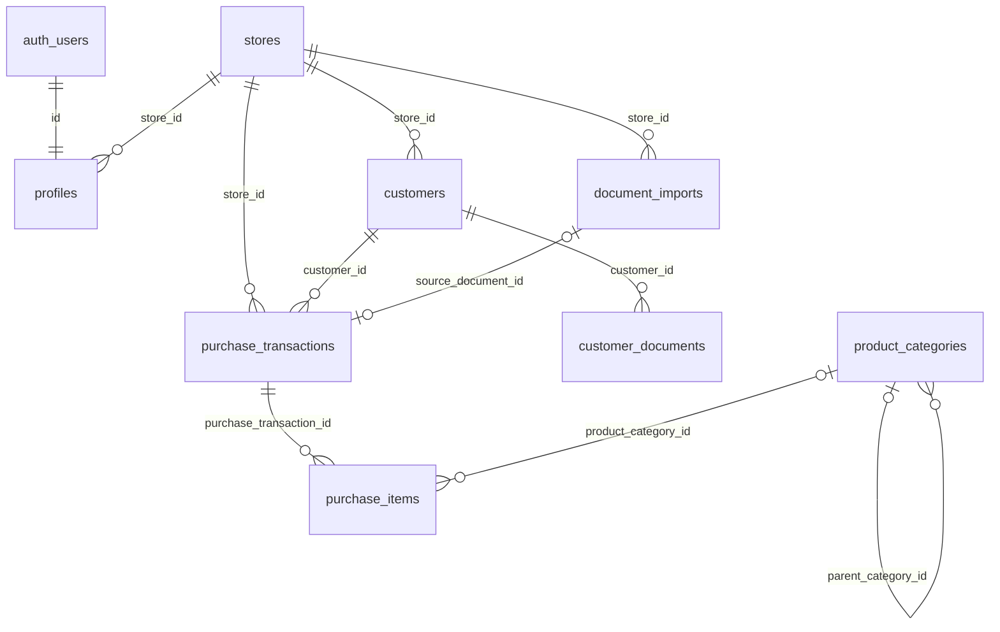

# DB設計

Phase1の実DDLは `supabase/migrations/202610010001_phase1_auth_stores.sql`。
以下の業務テーブルはPhase2の実装案。将来の卸・販売テーブルは定義しない。
全idはUUID。日時はtimestamptz、日付はdate、金額はnumeric(14,2)、数量/重量を数値化する場合はnumeric。
created_at / updated_atはnot null・now()、updated_atはDBトリガー更新。
指定のない業務値はnullを許可し、未読取・未確定を空文字や0と混同しない。

## Phase1：stores
| カラム | 型・制約 |
|---|---|
| id | uuid PK、gen_random_uuid() |
| code | text NOT NULL UNIQUE、trim済み非空・最大30文字 |
| name | text NOT NULL、trim済み非空・最大100文字 |
| is_active | boolean NOT NULL default true |
| created_at, updated_at | timestamptz NOT NULL |

物理削除はアプリに許可しない。無効化によってstaffのアクセスを停止する。

## Phase1：profiles
| カラム | 型・制約 |
|---|---|
| id | uuid PK / FK → auth.users.id、ON DELETE CASCADE |
| email | text NOT NULL、auth.users.emailと同期、アプリから編集不可 |
| name | text NOT NULL default ''、最大100文字 |
| role | text NOT NULL default staff、CHECK (admin, staff) |
| store_id | uuid nullable FK → stores.id、ON DELETE RESTRICT |
| is_active | boolean NOT NULL default false |
| created_at, updated_at | timestamptz NOT NULL |

有効staffはstore_id必須。adminはstore_idなしでも有効にできる。
Authユーザー作成時はinactiveのstaff・所属なし。role/name/storeはuser_metadataからコピーしない。
既存Authユーザーもmigrationでinactiveとして登録する。
store_idに索引。有効店舗かどうかはアクセス時に照会する。
メール変更はAuth側で行いトリガー同期。nameはポータル管理者が設定。

## Phase2案：customers
| カラム | 型・制約 |
|---|---|
| id | uuid PK |
| store_id | uuid NOT NULL FK → stores.id |
| name | text NOT NULL（確認後の登録で必須） |
| name_kana, occupation, postal_code, address, phone | text nullable |
| birth_date | date nullable |
| dm_allowed | boolean nullable（不明と不可を区別） |
| membership_card_number | text nullable、来店回数ではなくカード番号 |
| identification_type, identification_number | text nullable、将来保護用アクセス層に分離可能 |
| first_visit_date, last_visit_date | date nullable、取引登録/修正時に履歴から更新 |
| created_at, updated_at | timestamptz NOT NULL |

UNIQUE(id, store_id)で同一店舗FKの参照先を用意。
カード番号の全体一意制約や自動統合は設けない（記載・採番ルール未確定）。
store_idとカード/電話/氏名/生年月日検索の索引を追加し、比較用正規化を後続実装する。

## Phase2案：customer_documents
| カラム | 型・制約 |
|---|---|
| id | uuid PK |
| customer_id | uuid NOT NULL FK → customers.id |
| document_type | text NOT NULL。drivers_license / my_number_card / passport / otherを初期許容 |
| file_name | text NOT NULL |
| file_url | text NOT NULL、非公開Storageのオブジェクトパス（恒久公開URLにしない） |
| drive_file_id | text nullable、将来用 |
| uploaded_at, created_at | timestamptz NOT NULL |

顧客1人に複数画像。RLSはcustomersを参照し店舗所属を確認。
本人確認書類の保管対象・保存期限を運用で確認し、不要な情報を収集しない。

## Phase2案：document_imports
| カラム | 型・制約 |
|---|---|
| id | uuid PK |
| store_id | uuid NOT NULL FK → stores.id |
| document_type | text NOT NULL、purchase_document / customer_identification / membership_card / other |
| file_name, file_url | text NOT NULL、file_urlは非公開オブジェクトパス |
| drive_file_id | text nullable |
| processing_status | text NOT NULL default pending、pending / processing / review_required / completed / failed |
| error_message | text nullable、個人情報/外部API生エラーを保存しない |
| retry_count | integer NOT NULL default 0、CHECK >= 0 |
| processed_at | timestamptz nullable |
| created_at, updated_at | timestamptz NOT NULL |
| ai_result | jsonb nullable、Phase4追加案：構造化された読取原データ |
| reviewed_result | jsonb nullable、Phase4追加案：確認中データ。確定業務レコードと別 |
| ai_schema_version | text nullable、Phase4追加案：読取構造のバージョン |

UNIQUE(id, store_id)。AI結果は人の確認前でも取込テーブルに保存できるが、顧客/取引/明細には登録しない。
処理ロック・重複確定・再試行競合をPhase4–5で実装する。

## Phase2案：purchase_transactions
| カラム | 型・制約 |
|---|---|
| id | uuid PK |
| store_id | uuid NOT NULL FK → stores.id |
| customer_id | uuid NOT NULL、複合FK(customer_id, store_id) → customers(id, store_id) |
| document_number | text nullable（番号の一意性は業務確認後） |
| visit_datetime | timestamptz NOT NULL、確認時に必須 |
| purchase_staff_name, payment_staff_name | text nullable |
| transaction_status | text NOT NULL、初期CHECK completed / not_completed |
| visit_source, visit_source_detail | text nullable（FC変換ルールを埋め込まない） |
| purchase_item_count | integer nullable、CHECK >= 0 |
| purchase_total | numeric(14,2) nullable、CHECK >= 0 |
| source_document_id | uuid nullable UNIQUE、複合FK(source_document_id, store_id) → document_imports(id, store_id) |
| notes | text nullable |
| created_at, updated_at | timestamptz NOT NULL |

計算書1枚=1取引・1来店。取込原本1枚からの重複確定をUNIQUEで防ぐ。
statusはPostgreSQL enumに固定せずtext+CHECKで追加migrationにより拡張可能。
store_id・visit_datetime・customer_id・statusの索引。日次来店/成約はこのテーブルから算出。
買取金額集計の対象はcompleted、点数/合計と明細の不一致は確認画面で警告する後続案。
顧客と原本の他店舗紐付けを複合FKでDBレベルでも禁止する。

## Phase2案：purchase_items
| カラム | 型・制約 |
|---|---|
| id | uuid PK、将来の卸/販売連携用の安定キー |
| purchase_transaction_id | uuid NOT NULL FK → purchase_transactions.id |
| product_category_id | uuid nullable FK → product_categories.id |
| raw_item_name | text nullable、AI原読取値 |
| item_name | text NOT NULL、ユーザー確定値 |
| denomination_or_weight | text nullable、グラム/額面の原記載を保持 |
| quantity | numeric(12,3) nullable、CHECK >= 0 |
| purchase_amount | numeric(14,2) nullable、CHECK >= 0 |
| category_confidence | numeric(5,4) nullable、CHECK 0〜1 |
| category_reviewed | boolean NOT NULL default false |
| notes | text nullable |
| created_at, updated_at | timestamptz NOT NULL |

明細1行=1レコード。RLSは取引のstore_idを参照する。
親変更時もWITH CHECKで新しい取引の店舗を検証する。
AIのカテゴリ候補・確定カテゴリの表示をPhase5で実装し、信頼度だけで自動確定しない。

## Phase2案：product_categories
| カラム | 型・制約 |
|---|---|
| id | uuid PK |
| parent_category_id | uuid nullable FK → product_categories.id |
| category_name | text NOT NULL |
| category_level | integer NOT NULL、CHECK >= 1 |
| display_order | integer NOT NULL default 0 |
| is_active | boolean NOT NULL default true |
| created_at, updated_at | timestamptz NOT NULL |

共通マスタとしてadmin管理・staff参照。正式体系を勝手にseedしない。
親子構造とlevel整合性・循環禁止をPhase2のトリガー/管理処理で保証する。

## RLS・ファイルの後続設計
すべての業務表でRLSを有効化しauthenticatedだけに必要なSELECT/INSERT/UPDATE権限を付与する。
根テーブルはprivate.can_access_store(store_id)、子表は親レコード経由で同条件を検証する。
INSERT/UPDATEはWITH CHECKで他店舗への差替えを禁止。共通カテゴリの更新はadminだけ。
非公開Storageでは `<store UUID>/<import or customer UUID>/<random file name>` のパスを用い、
stores/profilesの有効状態をRLSで照会する。画面の画像参照は短時間署名URL。
トランザクション確定はログインユーザー権限のDB関数で実装する予定で、Service RoleによるRLS回避を常用しない。
